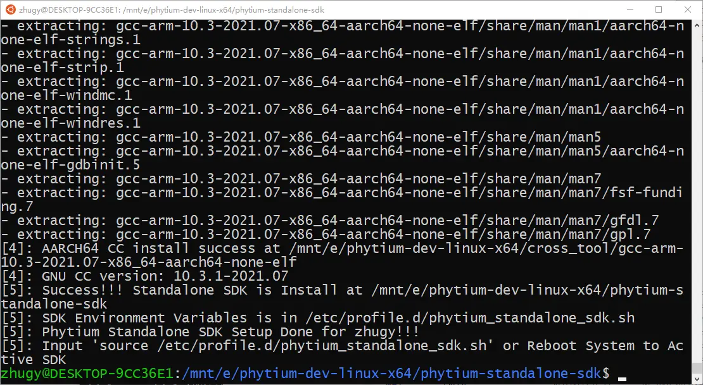
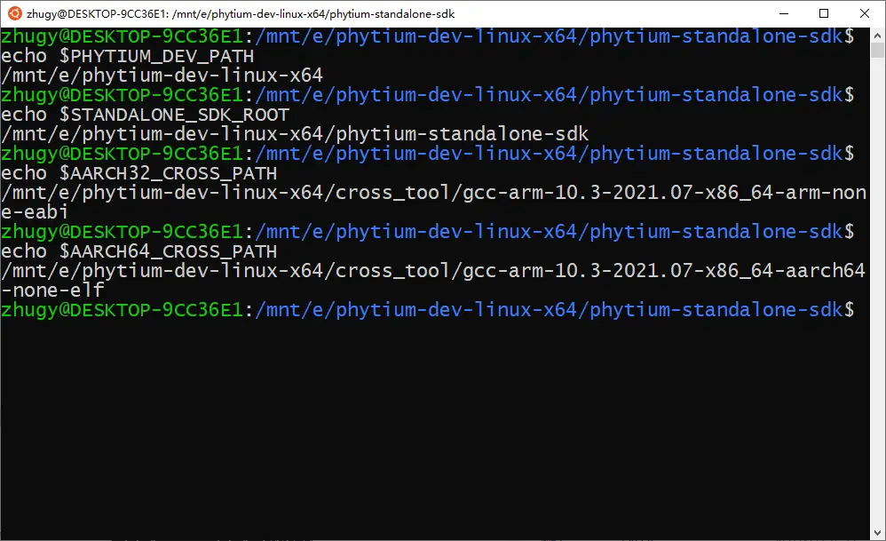

# 1. Windows下WSL Linux子系统 SDK安装方法

在Windows下，可以通过WSL Linux子系统来获得Linux环境，并且，这种环境下的Linux系统与Windows系统的文件是完全共享的
Linux x86_64下通过通过下载SDK开发工具包完成安装，安装前请先确认当前设备属于`Linux x86_64`

    ```
    uname -a
    ```

    

接下来正式开始安装SDK开发环境

## 1.1 系统安装与获取SDK的开发环境

- [Linux x86_64](https://pan.baidu.com/s/1KsGcHoqOJ8nv4G1G-L5gtQ  )
>提取码：LX64

Windows用户可以参考此链接，安装WSL Linux子系统，并做好相应准备工作：
- [WSL Linux子系统安装教程](https://zhuanlan.zhihu.com/p/146545159)

安装完毕后，启动Ubuntu，如果出现运行问题，可参考
- [WSL 无法安装解决方法](https://blog.csdn.net/qq_18625805/article/details/109732122)

在cmd上输入如下指令，查看WSL版本

```
wsl -l -v
```
由于WSL2不支持本地网线连接，如果发现目前版本是WSL2，需要退回到WSL1
```
wsl --set-version Ubuntu-20.04 1
```

>这里的20.04是Ubuntu的版本号，根据实际情况调整

正确结果如下

通过下面的指令完成对Linux系统的更新

```
apt update
apt upgrade
```

Linux环境下需要通过代码安装git, make和python3等工具

```
sudo apt-get install build-essential
```

## 1.2 安装SDK开发环境

- (1). 解压开发环境压缩包，形成DEV目录

    

Linux x86_64安装包集成了：
- `gcc-arm-10.3-2021.07-x86_64-aarch64-none-elf.tar.xz`和`gcc-arm-10.3-2021.07-x86_64-arm-none-eabi.tar.xz`，aarch64交叉编译链，在SDK安装过程中会被解压到DEV目录的`cross_tool`目录下

- `setup_dev.py`, 一种安装脚本，主要的功能包括创建sdk的profile文件，创建`PHYTIUM_DEV_PATH`环境变量，通过git拉取SDK源码，以及完成SDK安装

- (2). 进入DEV目录，运行`./setup_dev.py`，安装开发环境

    

    *如果无法正常运行请使用如下代码或者重启系统*

    ```
    python3 setup_dev.py
    ```


- (3). 安装完成后重启系统，或者关闭当前终端，新开一个终端继续后面的操作

- (4). 通过git拉取Phytium Standalone SDK的代码，如

    ```
    git clone https://gitee.com/phytium_embedded/phytium-standalone-sdk.git ./phytium-standalone-sdk
    ```

- (5). 进入Phytium Standalone SDK代码目录，运行`./install.py`

    ```
    cd ./phytium-standalone-sdk
    ./install.py
    
    >指令执行完毕后,按要求输入`source /etc/profile.d/phytium_dev.sh`指令获取环境变量或者重启系统
    ```

    

### Q: 如果当前环境无法连接互联网

- 在执行第（2）步前，需要手动下载Phytium Standalone SDK，放置在DEV目录下

- https://gitee.com/phytium_embedded/phytium-standalone-sdk

## 1.3 检查安装是否成功

- 打印下列环境变量，观察各变量是否存在，指向的目录是否正确
    >`PHYTIUM_DEV_PATH`指向DEV目录

    >`AARCH32_CROSS_PATH`指向32位交叉编译链目录

    >`AARCH64_CROSS_PATH`指向64位交叉编译链目录

    ```
    echo $PHYTIUM_DEV_PATH $AARCH32_CROSS_PATH $AARCH64_CROSS_PATH 
    ```
    

- 环境变量打印正确无误，表示**安装成功**
## 1.4 如何卸载开发环境


- 运行`rm /etc/profile.d/phytium_standalone_sdk.sh`，删除SDK配置文件

- 重启系统完成卸载
