# 使用方法
## 1.1前期配置
在正式调用SDK实例前，需要对tftp进行一系列配置，Windows下与Linux下的方法有很大的区别，下面我们正式开始
>对于权限不够的问题，普通用户可以在指令前加上`sudo`来暂时获得root权限

### 1.1.1 在 host 侧（Ubuntu 20.04）配置 tftp 服务

- 在开发环境`host`侧安装`tftp`服务
    ```
    sudo apt-get install tftp-hpa tftpd-hpa
    sudo apt-get install xinetd
    ```

- 新建 `tftboot`目录, `/mnt/d/tftboot`, 此目录应与项目编译脚本makefile中的USR_BOOT_DIR一致, 并确保 tftboot 目录有执行权限`chmod 777 /**/tftboot`

- 配置主机 tftpboot 服务, 新建并配置文件`/etc/xinetd.d/tftp`
  
    ```
    # /etc/xinetd.d/tftp

    server tftp
    {
    socket_type = dgram
    protocol = udp
    wait = yes
    user = root
    server =  /usr/sbin/in.tftpd
    server_args = -s /mnt/d/tftboot
    disable = no
    per_source = 11
    cps = 100 2
    flags = IPv4
    }
    ```

    在配置上述文件时，如果之前没有使用过Linux文件编写，可以使用自带的vim编辑器

    ```
    vim /etc/xinetd.d/tftp
    ```

- 启动主机`tftp`服务，生成默认配置
  
    ```
    $ sudo service tftpd-hpa start
    ```

- 修改主机`tftp`配置，指向`tftboot`目录，修改/etc/default/tftpd-hpa
  
    ```
    vim /etc/default/tftpd-hpa
    ```

    ```
    $ sudo vim /etc/default/tftpd-hpa
    # /etc/default/tftpd-hpa

    TFTP_USERNAME="tftp"
    TFTP_DIRECTORY="/mnt/d/tftboot"
    TFTP_ADDRESS=":69"
    TFTP_OPTIONS="-l -c -s"
    ```

- 重启主机`tftp`服务

    ```
    $ sudo service tftpd-hpa restart
    ```

    >注意，每次进入Linux系统时都需要使用该代码重启主机`tftp`服务
- 测试主机`tftp`服务的可用性
登录`tftp`服务，获取`tftboot`目录下的一个文件

    ```
    $ tftp 192.168.4.50
    tftp> get test1234
    tftp> q
    ```

### 1.1.2 在 host 侧（Windows）配置 tftp 服务

- 将`tftp.zip`解压到开发环境，如`D:\**\phytium-dev-windows-nt\tftp`
    >如果`phytium-dev-windows-nt\tftp`已经存在，则直接进行下一步

- 如果您还没有获取到tftp.zip，请前往[获取tftp.zip](https://pan.baidu.com/s/17WX5hec7t8_ubAKzFCwQAA)
>提取码：MGW6

- 以**管理员权限**打开Windows cmd，进入`D:\**\phytium-dev-windows-nt\tftp`，运行`.\reinstall.cmd`完成tftp服务安装

    
    
    >注意每次使用前，都需要进入Windows服务，手动将tftp服务打开

### 1.1.3 配置以太网ipv4设置

- 为了连接串口，打开windows下的以太网设置界面，选择手动设置，配置相关地址
    

## 1.2 连接开发板，着手跑通用例

- 在完成前面的步骤后，就可以着手连接开发板。连接之前，需要下载Windows下与的开发板配套软件
    [MobaXterm_Portable_v22.0](https://pan.baidu.com/s/1IjDG2j5YwK9IhpBR4ChoYA   )
>提取码：ROOT

- 如果是不用内置Linux子系统的windows用户还需要在`tftp`中配置。配置完成后，双击`D:\**\phytium-dev-windows-nt`目录的`run_tftd.cmd`，启动tftp工具，设置tftp目录和ip

>[如果没有run_tftd.cmd文件，请点击此处，进行sdk环境安装](./install_windows.md)

    

### 1.2.1 编译获取.elf与.bin文件

以WSL Windows11 为例:
- 进入SDK所在目录，右键打开Windows终端，输入以下指令

    ```
    wsl
    ```

- 其他Windows版本使用Windows PowerShell输入wsl命令，进入SDK根目录也可

    

- 进入`baremetal`文件夹，选取一个希望执行的用例。以`uart测试`为例，在wsl下输入如下指令，进入测试用例所在文件夹

    ```
    cd example/peripherals/serial
    ```

- 已经提供好具体的编译指令，以下进行介绍：
    1. make 将目录下的工程进行编译
    2. make clean  将目录下的工程进行清理（更改配置项目后，因为使用增量编译，所以需要先使用此指令，再调用 make all 或者 make image）
    3. make image  将目录下的工程进行编译，并将生成的elf 复制到目标地址
    4. make list_kconfig 当前工程支持哪些配置文件
    5. make load_kconfig LOAD_CONFIG_NAME=<kconfig configuration files>  将预设配置加载至工程中
    6. make menuconfig   配置目录下的参数变量
    7. make backup_kconfig 将目录下的sdkconfig 备份到./configs下

- 根据需求，配置在不同芯片下32位或64位的编译模式，这里以`飞腾腾珑E2000D`的32位为例，输入以下指令

    ```
    make load_kconfig LOAD_CONFIG_NAME=e2000d_aarch32_demo_serial
    ```

- 编译测试用例，输入以下指令

    ```
    make image
    ```

- 出现如下信息，表示编译成功，编译结果.elf与.bin文件已经保存至tftboot文件夹内
    

- 在一些例程中，可能需要编译出 .bin 以及一些调试文件,我们需要打开两个编译开关

    ```
    make menuconfig
    ```

    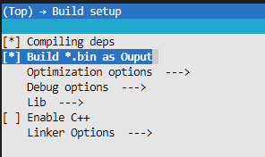

    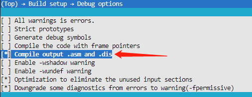

- 保存选项退出，后再编译

    

- 可以看到生成了汇编文件以及.bin文件，但是如果需要添加 `/mnt/d/tftboot/`,您可以在工程目录下的 `makeflie` 文件下的 image: 操作中，追加一条 `cp ./$(IMAGE_OUT_NAME).bin $(USR_BOOT_DIR)/baremetal.bin` 命令，或者手动复制。

### 1.2.2 配置开发板ip，连通host下载启动镜像
- 连通开发板串口，打开windows的设备管理器，在端口栏确认串口是否成果接入

    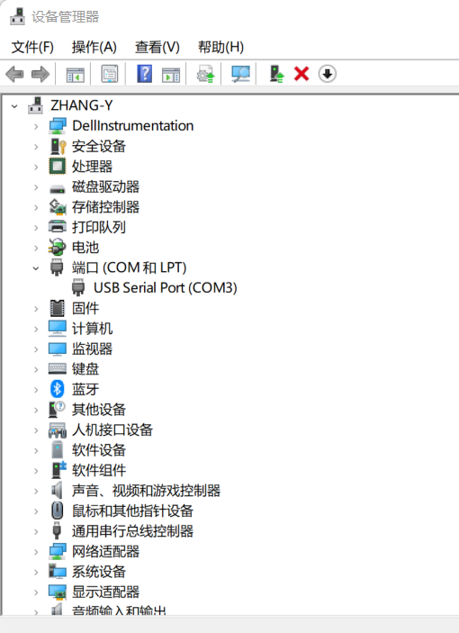

- 打开MobaXterm_Portable软件，选择`Session`，然后选择`Serial`，选择串口（如上图所示串口号为`COM3`），设置波特率`bps`为115200

- 进入`u-boot`界面，输入如下指令，配置开发板ip，`host`侧ip和网关地址

    ```
    setenv ipaddr 192.168.4.20  
    setenv serverip 192.168.4.50 
    setenv gatewayip 192.168.4.1 
    ```

#### .elf与.bin文件二选一

- 1.对于`ELF`文件，启动地址会自动获取，需要加载到`DRAM`中一段可用的地址，这里选择`0x90100000`
- 随后烧录`tftboot`文件夹下的文件到开发板，输入以下指令

    ```
    tftpboot 0x90100000 baremetal.elf
    bootelf -p 0x90100000
    ```

- 2.对于`BIN`文件,镜像启动的地址为`0x80100000`，需要直接加载到`0x80100000`，u-boot支持xmodem和ymodem，使用支持的串口终端调用`loadx 0x80100000`或者`loady 0x80100000`手动选择生成的`BIN`文件，待传输完成后，使用命令：

    ```
    go 0x80100000
    ```

- 见到如下结果，表示成功进入测试环境，可以自行浏览每个测试用例文件夹下对应的`README.md`文件，根据其中的提示，进行用例调试

    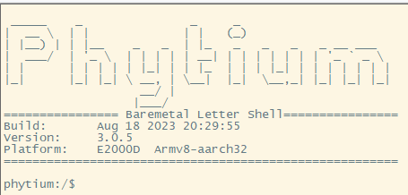
  
<!-- 支持使用以下几种方式跳转启动
- 1. `AARCH32/AARCH64`支持加载`BIN`文件到启动地址，刷新缓存后，通过`go`命令跳转启动

```
# tftpboot 0x80100000 baremetal.bin
# dcache flush
# go 0x80100000
```

- 2. `AARCH32/AARCH64`支持加载`ELF`文件到`DRAM`，通过`bootelf`解析跳转启动

```
# tftpboot 0x90100000 baremetal.elf
# bootelf -p 0x90100000
```

 -->


<!-- 

- 进入SDK，双击`D:\phytium-dev\phytium-standalone-sdk`目录下的`run_tftd.cmd`，启动tftp工具，设置tftp目录和ip


- 将镜像文件放置在上图所示的`%PHYTIUM_IDE_PATH%\tftp`目录下，开发板即可通过`tftpboot`加载镜像

> 在`template_mingw64`工程中，通过定义`USR_BOOT_DIR`可以将编译的镜像自动拷贝带tftp目录下 -->


### 1.2.3 如果设置板载FLASH自动启动，无需人工干预

- 此项设置是把bin镜像保存到和UBOOT相同的NOR FLASH芯片里。此芯片一般8MB。目前uboot里的flash读写命令，最大支持16MB
- uboot固件一般4MB左右。以下命令例子，把前6MB给uboot，从6MB到7MB的空间给bin镜像使用，操作命令如下，

- 通过串口或者网络下载到内存

    ```
    loadx 0x90100000
    tftpboot 0x90100000 baremetal.elf
    ```

- 将下载的镜像写入 QSPI NOR-Flash，位置为 0x600000，镜像大小为 0x100000
    > 如果下载的 bin/elf 镜像大小超过 0x100000 字节，需要随镜像大小进行调整

    ```
    flashe 0x600000   0x100000
    flashw 0x90100000 0x600000 0x100000 
    cmp.b  0x600000   0x90100000 0x100000 
    cp.b   0x600000   0x90100000 0x100000
    ```

- 然后就可以下电、上电启动，自动从 QSPI NOR-Flash 引导系统
    > 使用 saveenv 前，需要找 FAE 确认 u-boot 版本是否支持

    ```
    csetenv bootcmd "cp.b  0x600000  0x90100000 0xa00000; bootvx32 0x90100000"
    saveenv
    ```

- 如果用baremetal.bin文件，则把0x90100000改成0x80100000即可

### 1.2.4 将镜像放置在 SD 卡文件系统中，进行启动

- 以 Windows 10为例, 首先利用读卡器或者 SD 卡套将 SD 插入 Windows10 电脑接口，找到 SD 卡对应的磁盘

    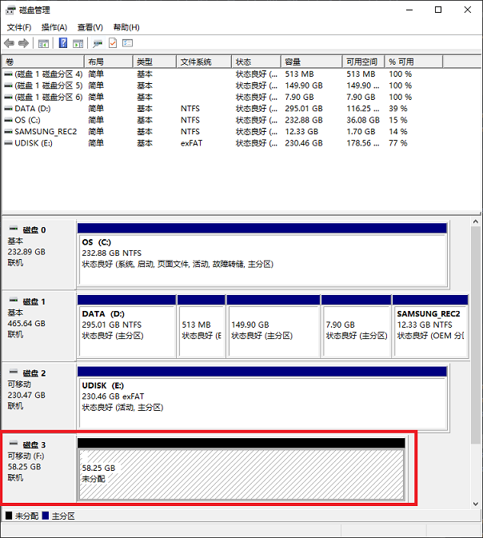

- 在 SD 卡磁盘上创建一个分区，格式为 FAT，由于 FAT 格式限制，分区不能超过太大，我们这里创建 256 MB 分区就可以了

    

- 将编译生成的 bin 文件或者 elf 文件放置在刚刚创建的 FAT 格式分区中

    

- 将 SD 卡从 Windows10 电脑中正常弹出，将 SD 卡插入开发板卡槽

    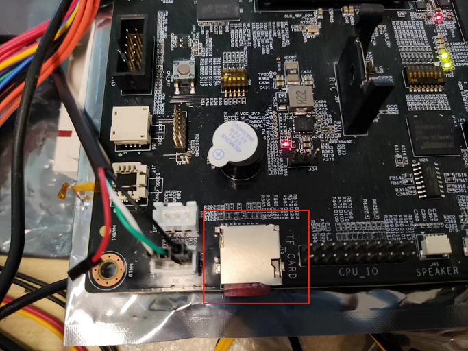

- 启动开发板，进入 u-boot 控制台，输入下列命令找到 bin/elf 镜像文件
    > 以 E2000-Demo 板为例，SD 卡槽连接的是 SD-1 控制器，

    ```
    mmc dev 1
    mmc info
    fatls mmc 1:1
    ```
    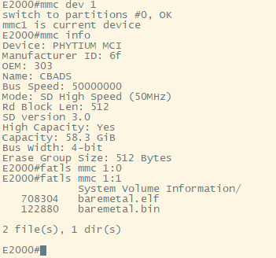

- 输入下列命令加载 elf 镜像，开始启动

    ```
    fatload mmc 1:1 0xa0100000 baremetal.elf
    bootelf -p 0xa0100000
    ```

- 使用 bin 镜像启动前，需要确保刷新过 cache
  
    ```
    fatload mmc 1:1 0x80100000 baremetal.bin
    dcache flush
    go 0x80100000
    ```

- 如果固件中没有 ```dcache flush```指令，可以在编译镜像时，将刷新cache的配置选择

    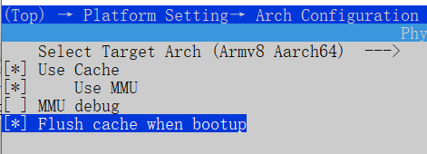


- 输入下列命令，可以下电、上电启动，自动从 SD 卡介质中引导系统

    > 使用 saveenv 前，需要找 FAE 确认 u-boot 版本是否支持

    ```
    setenv bootcmd "mmc dev 1; fatload mmc 1:1 0x90100000 baremetal.elf; bootelf -p 0x90100000"
    saveenv
    ```

### 1.2.5 将镜像放置在 U盘文件系统中，进行启动

- 以 Windows 10为例, 首先将 U 盘插入 Windows10 电脑接口，找到 SD 卡对应的磁盘
- 在 U 盘上创建一个分区，格式为 FAT，由于 FAT 格式限制，分区不能超过太大，我们这里创建 128 MB 分区就可以了

    

- 将编译生成的 bin 文件或者 elf 文件放置在刚刚创建的 FAT 格式分区中

- 将 U 盘从 Windows10 电脑中正常弹出，将 U 盘插入开发板USB插槽

    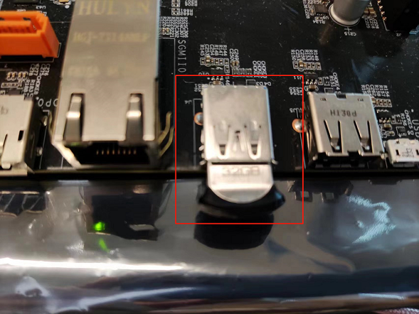

- 启动 USB 控制器，找到 U 盘中的

    ```
    usb start
    usb storage
    fatls usb 0
    ```

    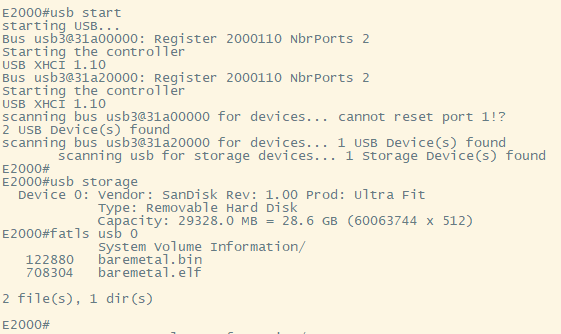


- 输入下列命令加载 elf 镜像，开始启动

    ```
    fatload usb 0 0xa0100000 baremetal.elf
    bootelf -p 0xa0100000
    ```

- 使用 bin 镜像启动前，需要确保刷新过 cache
  
    ```
    ffatload usb 0 0x80100000 baremetal.bin
    dcache flush
    go 0x80100000
    ```

- 输入下列命令，可以下电、上电启动，自动从 U盘引导系统

    > 使用 saveenv 前，需要找 FAE 确认 u-boot 版本是否支持

    ```
    setenv bootcmd "usb start; fatload usb 0 0x90100000 baremetal.elf; bootelf -p 0x90100000"
    saveenv
    ```

## 1.3 新建一个baremetal应用工程
如果您希望自己建立一个应用工程，可以参考下面的流程
### 1.3.1 选择工程模板

- 复制`~/standalone-sdk/example/template`目录，作为 baremetal 应用工程

    > `*` 表示可选文件/目录

    ```
    $ ls
    Kconfig       --> 应用工程配置menu文件
    makefile      --> makefile
    main.c        --> 包含main函数
    sdkconfig     --> 配置输出
    sdkconfig.h   --> 配置输出
    inc           --> 用户头文件*
    src           --> 用户源文件*
    ```

    >请注意使用小写makefile，使用Makefile在部分平台不能被识别

### 1.3.2 选择目标平台

- 切换目标平台, e.g `FT2000/4 AARCH32`, 加载默认配置

    ```
    make config_ft2004_aarch32
    ```

    > 使用`FT2000-4`作为目标编译平台，通过`make config_ft2004_aarch32`和`make config_ft2004_aarch64`加载默认配置

    > 使用`D2000`作为目标编译平台，通过`make config_d2000_aarch32`和`make config_d2000_aarch64`加载默认配置

- 编译应用工程, 生成`*.bin`文件用于下载到开发板

    ```
    $ make
    $ ls
    template.bin   --> 二进制文件
    template.dis   --> 反汇编文件
    template.elf   --> ELF文件
    template.map   --> 内存布局文件
    ```

    

### 1.3.3 快速使用例程

- 将`BIN`文件或者`ELF`文件复制到`tftpboot`目录

  ```
  $ cp ./baremetal.bin /mnt/d/tftboot
  $ cp ./baremetal.elf /mnt/d/tftboot
  ```

  > ~/standalone-sdk/example/aarch32_hello_world

  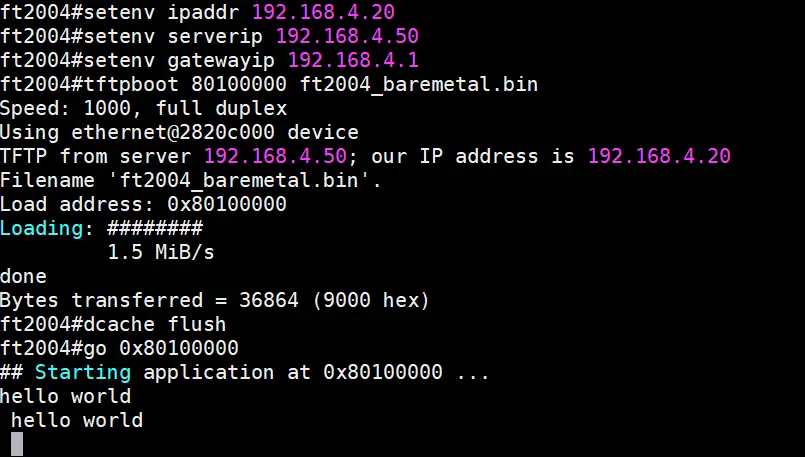

- 结合1.2节中的操作，即可快速使用自己创建的例程